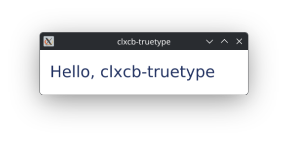

# clxcb-truetype

Pure Common Lisp TrueType font rendering for XCB.

## Overview

clxcb-truetype renders antialiased TrueType text onto X11 drawables,
windows and pixmaps, using XCB and the RENDER extension.  Glyph
outlines are read from TTF files by ZPB-TTF and rasterized to 8-bit
coverage masks by CL-VECTORS and CL-AA, one glyph at a time.  Each glyph
is uploaded once per connection into a RENDER glyph set, and a string is
drawn with one small request naming its glyphs -- the way Xft draws
text.

This is a port of [clx-truetype][clx-truetype] from CLX to XCB.  The
rasterization pipeline (ZPB-TTF → CL-VECTORS → CL-AA) is reused
unchanged; the X-specific code was rewritten against clxcb-truetype's
own drawable wrappers, and the CLX cache layers were replaced with
hash tables keyed on the connection.

[clx-truetype]: https://github.com/stumpwm/clx-truetype

## Requirements

- SBCL, preferably.  The library is developed and tested on SBCL.
  It uses portable libraries rather than SBCL-isms, so it may work on
  other implementations, but I haven't tested them myself.
- ASDF 3.x for building the library
- UIOP for portable getenv and directory/file listing
- [clxcb][clxcb] — the XCB binding this library draws through
- [zpb-ttf][zpb-ttf] — TrueType font parser
- [cl-vectors][cl-vectors], [cl-paths-ttf][cl-paths-ttf], [cl-aa][cl-aa]
  for path representation and rasterization
- [cacle][cacle] — LFU caches for string metrics and alpha maps
- [trivial-garbage][trivial-garbage] for portable finalizers
- [bordeaux-threads][bordeaux-threads] for the locks around the finalizer
  queue, the font loaders and the font cache

## Quick start

Load the system and build the font cache:

    (asdf:load-system :clxcb-truetype)
    (xcb-truetype:cache-fonts)

`cache-fonts` scans `*font-dirs*` (by default `/usr/share/fonts/`,
`/usr/local/share/fonts/`, `~/.local/share/fonts/`, `~/.fonts/`, and on
macOS also `/Library/Fonts/` and `/System/Library/Fonts/`) and indexes
every `.ttf` it finds.  It only needs to be called once per image, or again after
installing a new font.

Wrap an XCB window or pixmap in a `window` or `pixmap` object, and
draw a string on it.  A window is drawn on once the server has sent an
Expose event for it:

    (xcb:with-x-connection (conn)
      (let* ((screen (first (xcb:conn-roots conn)))
             (win-id (xcb:generate-id conn))
             (font   (make-instance 'xcb-truetype:font
                                    :family    "DejaVu Sans"
                                    :subfamily "Book"
                                    :size      24)))
        (xcb:create-window conn 0 win-id (xcb:root screen) 100 100 400 200 0
                           xcb-const:+window-class-input-output+ 0
                           (logior xcb-const:+cw-back-pixel+
                                   xcb-const:+cw-event-mask+)
                           :background-pixel (xcb:black-pixel screen)
                           :event-mask xcb-const:+event-mask-exposure+)
        (xcb:map-window conn win-id)
        (xcb:flush conn)
        (let ((win (make-instance 'xcb-truetype:window
                                  :connection conn :id win-id :screen screen)))
          ;; ... wait for the window's Expose event, then:
          (xcb-truetype:draw-text win font "Hello, clxcb-truetype" 10 60
                                  :colour #xFFFFFF)
          (xcb:flush conn))))

`examples/hello.lisp` is the complete program, with the event loop.
Load and run it with:

    (load "examples/hello.lisp")
    (clxcb-truetype-example:hello)

You should see a simple message:

## API

### Fonts

`make-instance 'font :family ... :subfamily ... :size ...` builds a
font object.  `subfamily` may be omitted or NIL, in which case the
first of Regular, Book, or the first available subfamily is chosen.

The accessors are `font-family`, `font-subfamily`, `font-size`,
`font-underline`, `font-strikethrough`, `font-overline`,
`font-antialias`.  All of them have `setf` methods that flush the
font's string caches, so a font can be reused and reconfigured.

`cache-fonts` repopulates `*font-cache*` from `*font-dirs*`.  Use
`get-font-families` and `get-font-subfamilies` to enumerate what's
installed.

### Drawables

`window` and `pixmap` are the two drawable classes, one for each X
drawable type; `drawable` is their abstract base and cannot be made
itself.  A drawable carries its connection, its XID, its visual
(defaulting to the screen's root visual), and its screen.

Whoever creates an X resource frees it.  A drawable always frees the
RENDER picture it creates for drawing.  It frees the window or pixmap
itself only when it owns it, given `:owned t` when it is made:

    (make-instance 'xcb-truetype:window :connection c :id win)
        ;; frees only its picture: the window is the application's
    (make-instance 'xcb-truetype:pixmap :connection c :id pm :owned t)
        ;; also frees the pixmap

`destroy-drawable` frees the picture, and the window or pixmap too if
the drawable owns it.  `release-drawable` frees only the picture.  Every
drawable also has a finalizer installed at construction as a safety
net; the finalizer does not write to the X socket — it queues a free
request on a weak per-connection list, drained by
`flush-deferred-frees` (which `draw-text`, `draw-text-line`, and
`destroy-drawable` call automatically).

### Drawing

    (draw-text      drawable font string x y &key colour)
    (draw-text-line drawable font string x y &key colour)

Both draw STRING with its baseline at (x, y).  They differ in the box
that underline, strikethrough and overline span: the ink bounding box
for `draw-text`, the advance-width line box for `draw-text-line`, which
is what you want for laying out multiple lines.

Text is drawn through RENDER glyph sets: each glyph is rasterized once
per face, size and DPI, and uploaded once per connection, so drawing a
string again costs a few bytes per character.  Each glyph's origin is
put on a whole pixel, so a line is never more than half a pixel off its
measured width.  Binding `*draw-with-glyph-sets*` to NIL draws the old
way instead, rasterizing and uploading the whole string on every call.

`colour` is an `#x00RRGGBB` integer; the renderer expands it to the
16-bit channels RENDER expects.

### Metrics

The metric functions take a *target* — a drawable, a screen, an
integer DPI, or a `(dpi-x . dpi-y)` cons — and a font:

    (text-width             target font "string")
    (text-height            target font "string")
    (text-line-width        target font "string")
    (text-line-height       target font "string")
    (font-ascent            target font)
    (font-descent           target font)
    (font-line-gap          target font)
    (baseline-to-baseline   target font)

`fit-font` and `text-center` are convenience wrappers:

    ;; Return a font sized so string fits inside the box.
    (fit-font drawable "DejaVu Sans" "Book" string box-width box-height
              :min-size 8)

    ;; Return (values baseline-x baseline-y) that centre string in the box.
    (text-center drawable font string box-width box-height)

### Caches

`*font-cache*` maps family names to subfamily-to-pathname tables.
`*font-loader-cache*` holds open ZPB-TTF loaders keyed by pathname;
call `close-font-loaders` to close them.

`cache-fonts` scans into a new table and swaps it in when done, so
other threads go on finding fonts while it runs.

Each glyph, rasterized for one face at one size and DPI, is kept on
the client (at most 256 faces' worth) and uploaded once per connection
into a glyph set.  A connection keeps at most 64 glyph sets, one per
face, size, DPI and antialiasing, freeing the least recently used.

`*fill-cache*`, `*mask-gc-cache*` and the glyph sets are kept in weak
hash tables keyed on connection, holding solid-fill pictures, the
depth-8 GC used for mask uploads, and glyph sets.  None keeps a
connection alive; the server frees what they hold when the connection
closes.

## Differences from clx-truetype

If you are migrating from the CLX version:

- **XCB, not CLX**:  No `xlib` symbols, no second connection type.
  Everything draws through a connection produced by `xcb:`.

- **Drawable wrapper classes**:  `window` and `pixmap` wrap an XID
  and its connection.  `drawable` is abstract; instantiate one of the
  two concrete classes.  They free the window or pixmap only when made
  with `:owned t`; clx-truetype's always did.

- **Colour is passed explicitly**:  `draw-text` and `draw-text-line`
  take `:colour #x...` rather than reading the current foreground off
  a GC, because XCB has no way to read GC state back.  The 1×1 pen
  pixmap trick is gone; a solid-fill picture per colour is used
  instead.

- **Glyph sets**:  Text is drawn through RENDER glyph sets, as Xft
  does, instead of rasterizing and uploading each string's alpha mask
  on every call: about 30 times faster for a repeated string and over
  100 times for a new one, and only a few bytes per character over
  `ssh -X`.  Glyphs sit on whole pixels; underline, strikethrough and
  overline are crisp whole-pixel lines; and `draw-text-line` no longer
  clips the overline away.  See `CHANGES`.

- **No `draw-background-p`**:  The background fill that clx-truetype
  performed per call is not implemented; callers draw their own
  background rectangle first.

- **Caches keyed on connection**:  The plist-based drawable caches are
  replaced by weak hash tables keyed on the connection object, so a
  connection that becomes unreachable does not keep its cache or
  itself alive.

- **Deferred finalization**:  Finalizers queue frees on a weak
  per-connection list rather than writing to the socket.  The queue
  is drained on the application thread.

## Tests

    tests/run.sh                  # all tests
    tests/run.sh bench.lisp       # only those named

`run.sh` starts a scratch Xephyr server with two screens (depths 24
and 16) on display `:11`, or on `XEPHYR_DISPLAY`, runs each test in a
fresh SBCL, and stops the server.  Any Xephyr already on that display is
stopped first, so do not point it at one you use.  It exits non-zero if
a check fails.

- `drawables.lisp`: ownership, and which drawable classes can be made
- `font-cache.lisp`: font lookups during a rescan, units per em
- `screens-and-threads.lisp`: two screens, four threads on one connection
- `glyphs-vs-masks.lisp`: glyph sets against the old alpha masks;
  prints ink per case and writes `cmp-NN.pgm` images, old above new
- `bench.lisp`: time per string, both ways

## License

The GNU Lesser General Public License, version 2.1 or later
(`LGPL-2.1-or-later`).  See `LICENSE`, and `COPYING` for the license
text.

clxcb-truetype is a derivative work of [clx-truetype][clx-truetype] by
Michael Filonenko and contributors, which was published under the MIT
license.  clx-truetype is said to have grown out of McCLIM's TrueType
rendering, which is under the LGPL; that could not be confirmed, so
clxcb-truetype uses McCLIM's license, which is right either way.  The
MIT notice of clx-truetype's code is kept in `LICENSE`.  See `AUTHORS`
for everyone who worked on it, and for what is known of the history.

## History

According to online research, clx-truetype grew out of the TrueType
rendering written for McCLIM by Gilbert Baumann and Andy Hefner; we
have not had this confirmed by them (see `AUTHORS`).  It was written
and maintained by Michael Filonenko.  It is the standard text renderer for [StumpWM][stumpwm],
via the [ttf-fonts][ttf-fonts] contrib module.

clxcb-truetype ports the X-specific portions of that library to XCB
while keeping the client-side rasterization pipeline intact.

[clxcb]:            https://github.com/amno1/clxcb
[zpb-ttf]:          https://github.com/xach/zpb-ttf
[cl-vectors]:       https://github.com/fjolliton/cl-vectors
[cl-paths-ttf]:     https://github.com/fjolliton/cl-vectors
[cl-aa]:            https://github.com/fjolliton/cl-vectors
[cacle]:            https://github.com/jlahd/cacle
[trivial-garbage]:  https://github.com/trivial-garbage/trivial-garbage
[bordeaux-threads]: https://github.com/sionescu/bordeaux-threads
[stumpwm]:        https://github.com/stumpwm/stumpwm
[ttf-fonts]:      https://github.com/stumpwm/stumpwm-contrib/tree/master/util/ttf-fonts
